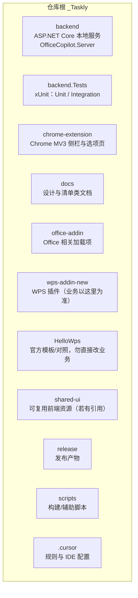
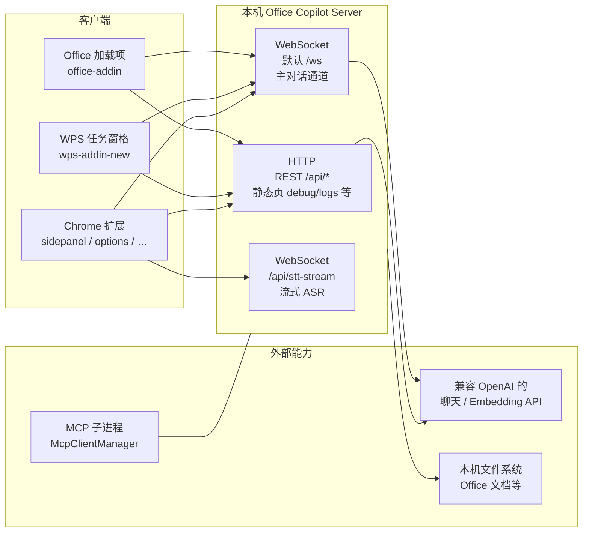
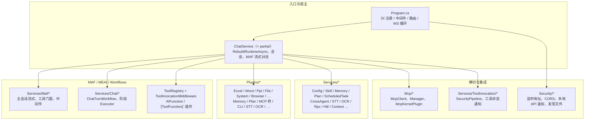
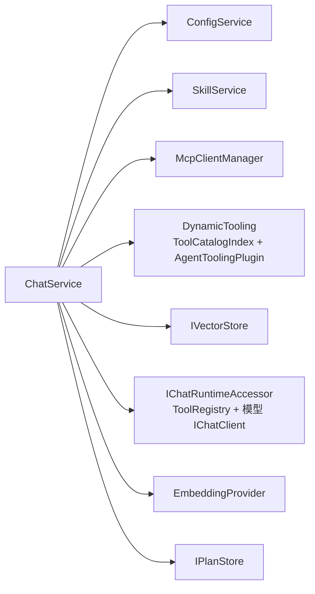
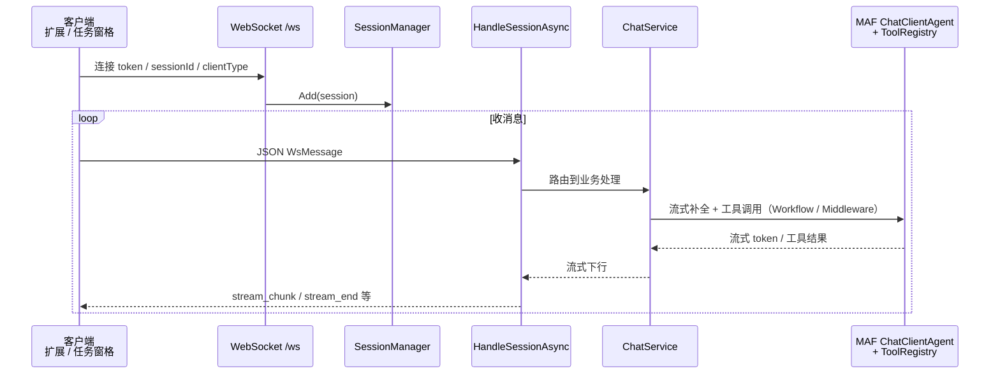
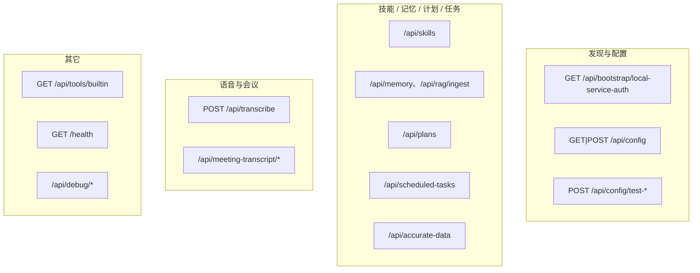
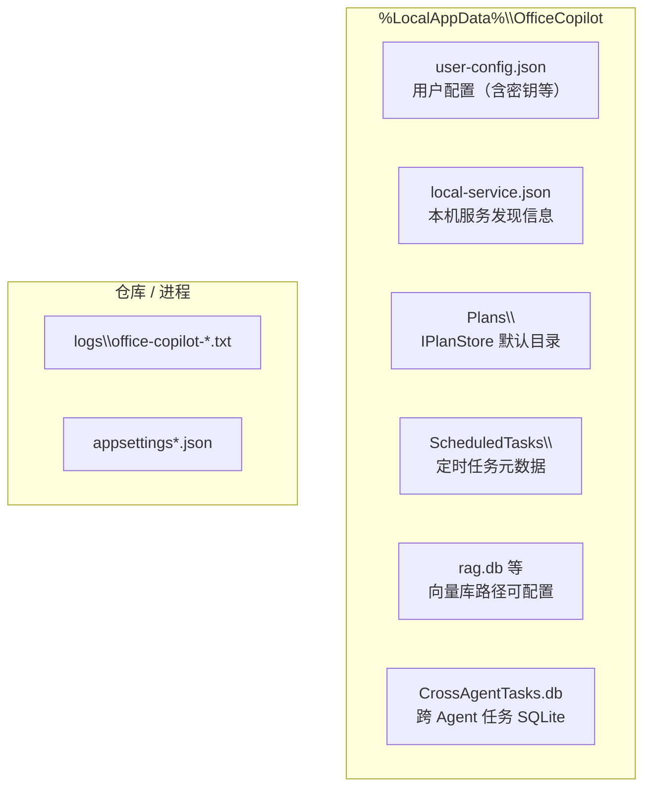
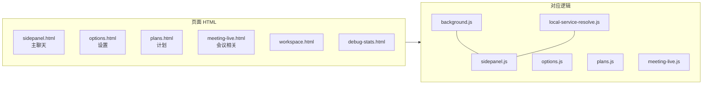
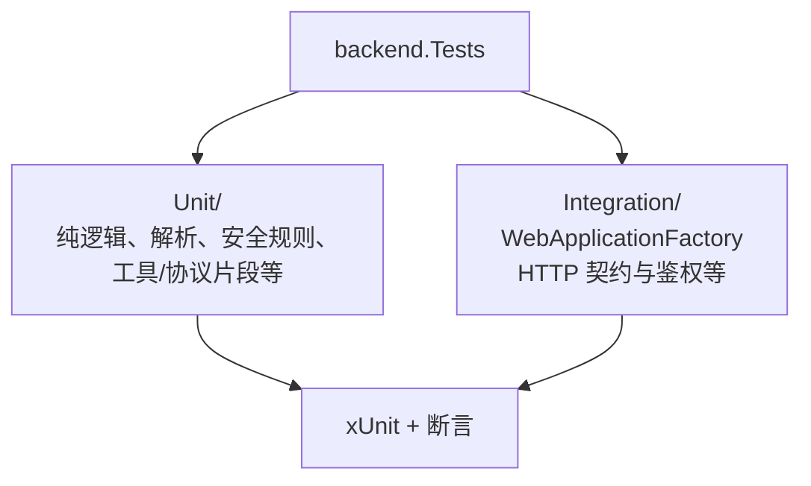
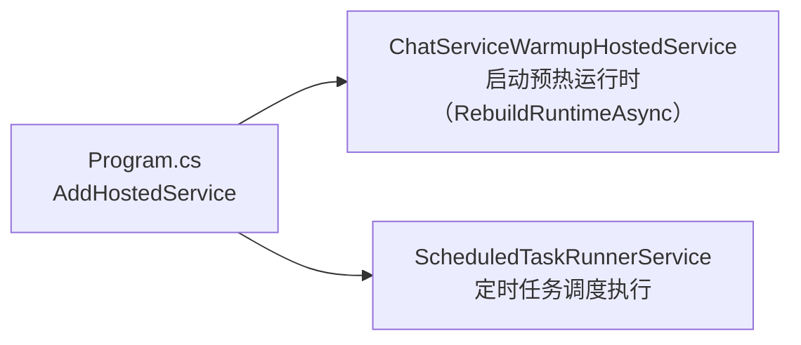

# Office Copilot（_Taskly）项目结构 — 多维视图

本文用 **Markdown + Mermaid** 从多个角度描述仓库与运行时结构，便于新人定位代码与排障。  
在支持 Mermaid 的编辑器中打开本文件即可预览图；GitHub 对 Mermaid 也有基础支持。

> **说明**：图中名称与路径以当前仓库为准；默认监听端口以 `appsettings` / 扫描结果为准（常见为 `8765` 起跳）。  
> **编排栈**：主会话已迁移至 **MAF + MEAI**（`IChatClient` / `ChatClientAgent`），不再使用 Semantic Kernel；详见 [`maf-migration-baseline.md`](./maf-migration-baseline.md)。已移除的 MAF 宿主调试端点见 [`maf-host-debug-removal.md`](./maf-host-debug-removal.md)。

---

## 1. 仓库顶层（物理目录）

---

## 2. 运行时拓扑（谁连谁）

**要点**：扩展与 Office/WPS 通过 **端口扫描 + `/api/bootstrap/local-service-auth`** 等发现本机服务；主交互在 **WebSocket**（配置项 `WebSocket:Path`，默认 `/ws`）。**WPS**：加载项在 `set_context` 中上报 **`wpsHostKind`**（`word` / `et` / `wpp` 等），后端据此在 `clientType=wps` 时可选收窄 **`CurrentDocument`** 具名工具及动态工具索引，与 `office-*` 子集对齐；未上报或 `unknown`/`none` 时不收紧（见 `ClientTypeToolFilter`、`docs/应用内AI插件列表.md` §三）。

---

## 3. 后端 `backend` 目录分层

---

## 4. `ChatService` 核心依赖（简化）

配置或技能变更时会触发 **`RebuildRuntimeAsync`**（重建 `ToolRegistry`、模型客户端与 MCP 绑定等，见 `ChatService`）。

---

## 5. 主对话 WebSocket 消息流（概念）

（RPC、HITL、附件缓存等在同一 `HandleSessionAsync` 链路中按需介入，此处不展开每一条分支。）

---

## 6. HTTP `/api/*` 分组（按职责）

完整路由以 `Program.cs` 中 `MapGet` / `MapPost` 等为准。

---

## 7. 本机数据与配置文件（概念）

---

## 8. Chrome 扩展主要页面与脚本

---

## 9. `backend.Tests` 测试布局

运行：`dotnet test backend.Tests/backend.Tests.csproj`；筛选 `FullyQualifiedName~Unit` 或 `~Integration`。

---

## 10. 后台托管服务（HostedService）

---

## 11. Harness 与工具契约（驾驭工程）

对照 `.cursor/rules/harness-engineering.mdc`：Agent 可靠性优先靠**环境与边界**，而非只加长提示词。

**改插件工具函数时建议同步检查：**

1. 函数上的 `[Description]`（及 `[ToolFunction]` 元数据）是否写清输入形状与失败时模型可执行的重试方式（另见 `error-visibility`）。
2. [`docs/提示词清单.md`](docs/提示词清单.md) 中与默认 system 相关的句子是否与 [`ConfigService`](backend/ConfigService.cs) 一致。
3. 主会话动态工具：`ToolCatalogIndex` 检索质量、`AgentToolingPlugin` 的 `[Description]` 与 [`DynamicToolingInstruction`](backend/Services/DynamicTooling/DynamicToolingInstruction.cs) 是否与 `Program.cs` 注册的工具一致；计划撰写见 `PlanPlugin` + `PlanAuthoringToolDigest`。
4. 若涉及**多行/结构化字符串**工具参数，优先在服务端做确定性解析（例如 Word `paragraphs`、PPT `bodyText` 经 `ToolMultilineTextNormalizer`），并补 [`backend.Tests/Unit`](backend.Tests/Unit) 单测。
5. **用户技能**（`SkillAuthorPlugin` 生成内容）中列举的插件名应与上述字典及真实注册名一致，避免技能误导后续工具选择。

---

## 维护建议

- **改路由或契约**：同步更新本文件中的 API 分组图，并优先对照 `.cursor/rules` 里的 `api-json-contract` / `api-frontend-backend-contract`。
- **改工具或插件**：对照上文 **§11 Harness 与工具契约** 的检查清单。
- **新增大模块**：在「后端分层」或「运行时拓扑」中补一个子图即可，避免单图节点过多导致 Mermaid 难以阅读。

如需把某一维拆成独立短文（例如只画 MCP 生命周期），可在 `docs/` 下新增专题 MD 并链回本文。
