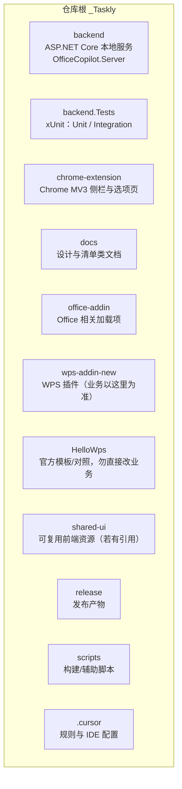
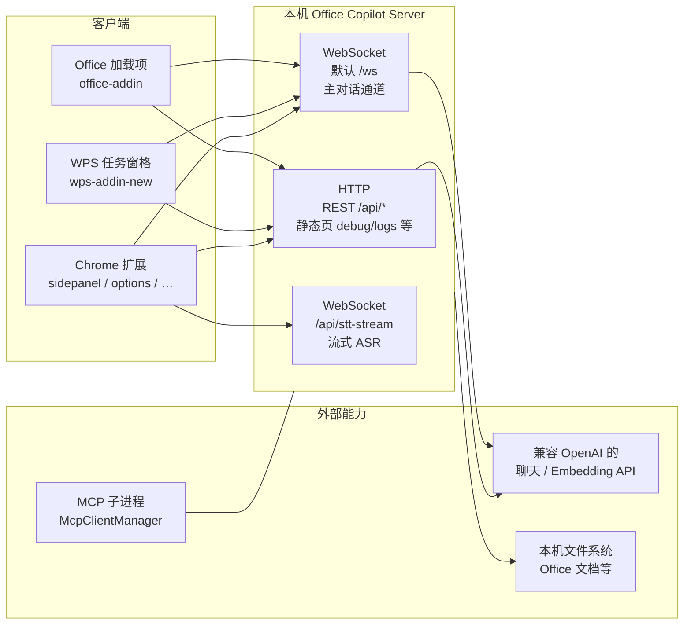
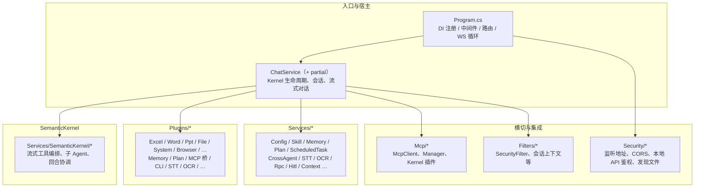
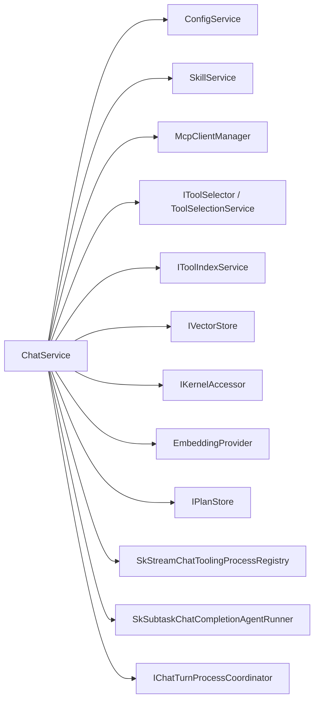
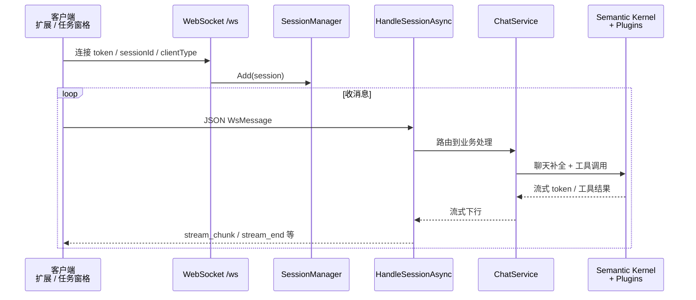
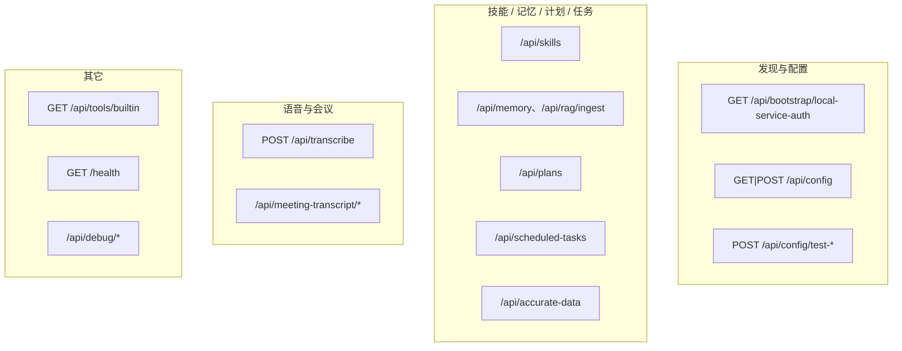
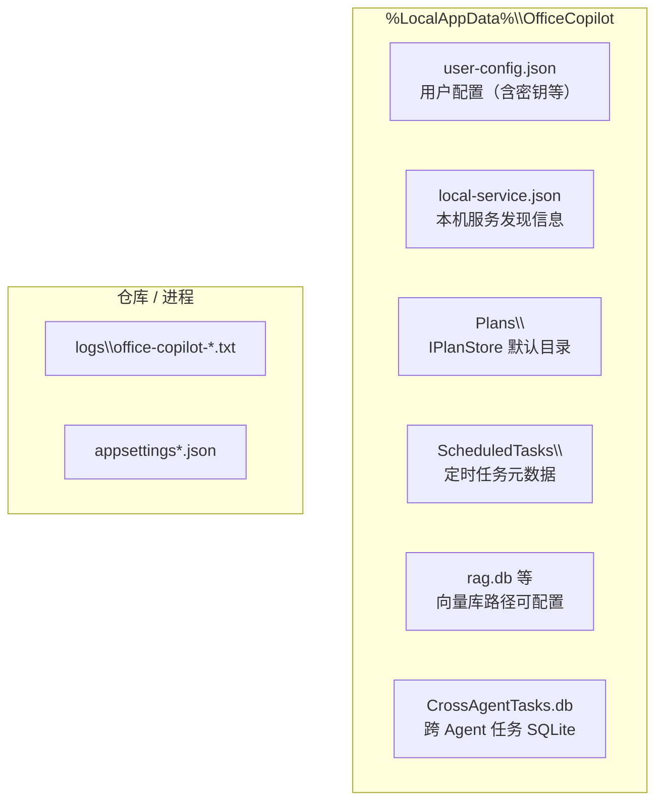
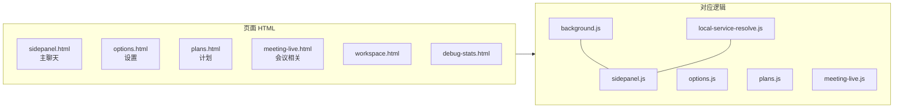
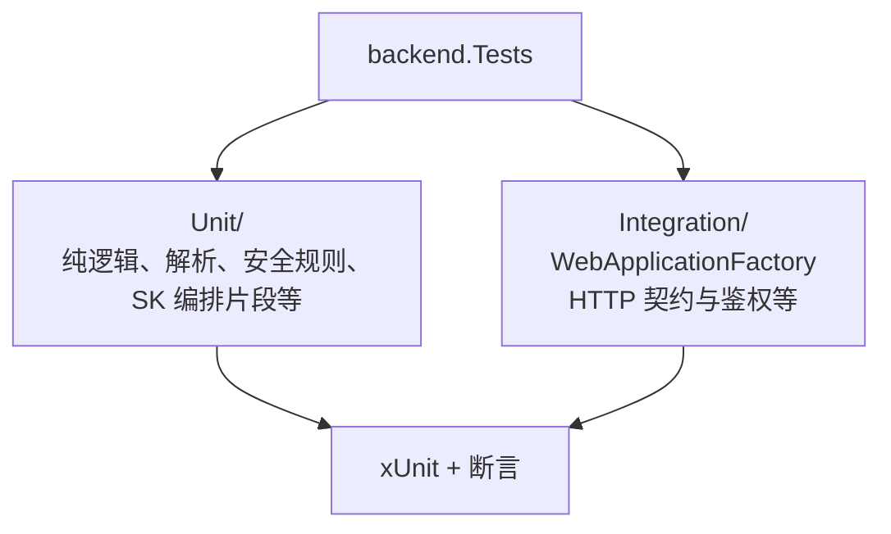
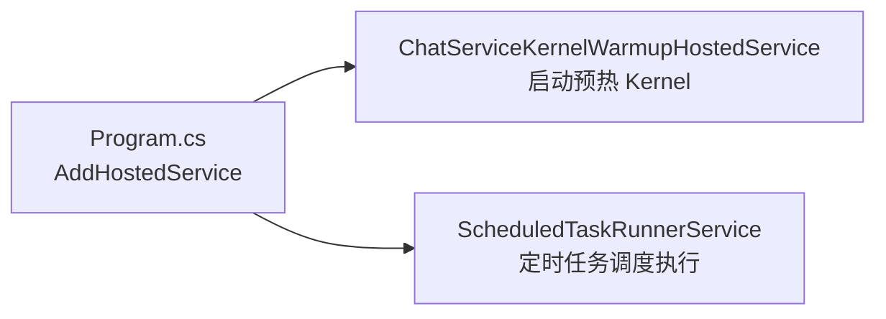

# Office Copilot（_Taskly）项目结构 — 多维视图

本文用 **Markdown + Mermaid** 从多个角度描述仓库与运行时结构，便于新人定位代码与排障。  
在支持 Mermaid 的编辑器中打开本文件即可预览图；GitHub 对 Mermaid 也有基础支持。

> **说明**：图中名称与路径以当前仓库为准；默认监听端口以 `appsettings` / 扫描结果为准（常见为 `8765` 起跳）。

---

## 1. 仓库顶层（物理目录）

---

## 2. 运行时拓扑（谁连谁）

**要点**：扩展与 Office/WPS 通过 **端口扫描 + `/api/bootstrap/local-service-auth`** 等发现本机服务；主交互在 **WebSocket**（配置项 `WebSocket:Path`，默认 `/ws`）。

---

## 3. 后端 `backend` 目录分层

---

## 4. `ChatService` 核心依赖（简化）

配置或技能变更时会触发 **重建 Kernel**（与 MCP、内置/用户工具索引同步相关逻辑在 `ChatService` 内）。

---

## 5. 主对话 WebSocket 消息流（概念）

（RPC、HITL、附件缓存等在同一 `HandleSessionAsync` 链路中按需介入，此处不展开每一条分支。）

---

## 6. HTTP `/api/*` 分组（按职责）

完整路由以 `Program.cs` 中 `MapGet` / `MapPost` 等为准。

---

## 7. 本机数据与配置文件（概念）

---

## 8. Chrome 扩展主要页面与脚本

---

## 9. `backend.Tests` 测试布局

运行：`dotnet test backend.Tests/backend.Tests.csproj`；筛选 `FullyQualifiedName~Unit` 或 `~Integration`。

---

## 10. 后台托管服务（HostedService）

---

## 维护建议

- **改路由或契约**：同步更新本文件中的 API 分组图，并优先对照 `.cursor/rules` 里的 `api-json-contract` / `api-frontend-backend-contract`。
- **新增大模块**：在「后端分层」或「运行时拓扑」中补一个子图即可，避免单图节点过多导致 Mermaid 难以阅读。

如需把某一维拆成独立短文（例如只画 MCP 生命周期），可在 `docs/` 下新增专题 MD 并链回本文。
