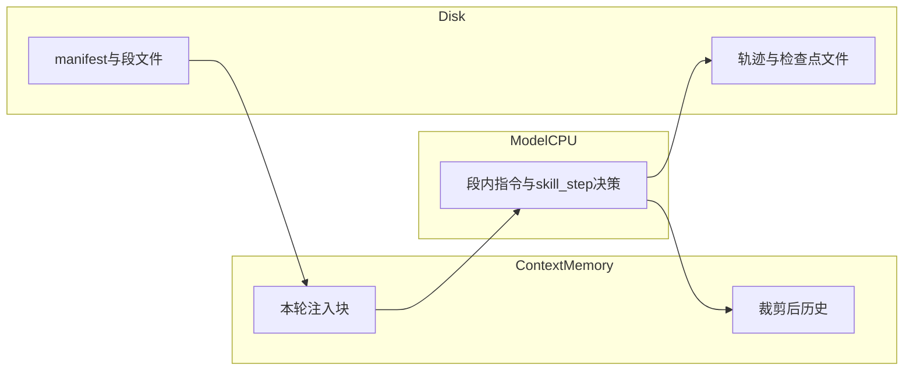
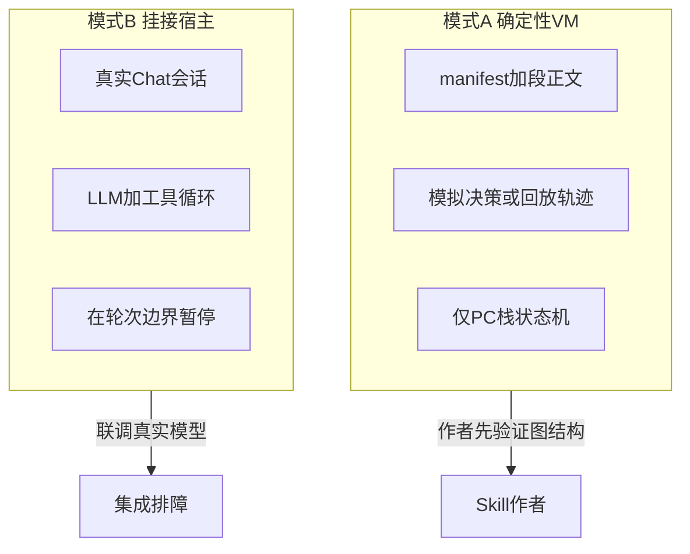

# 脚本式 Skill 调试器 — 设计计划

> 本文档与 [skills-scripted-vm-plan.md](skills-scripted-vm-plan.md) 配套：在「段 + PC + 状态」的 Skill VM 之上，描述**作者向调试工具**的形态、调试原语与落地顺序。调试器在 Taskly **同一 Git 仓库内**以**独立子项目**实现（见下文「仓库与工程结构」）。

## 背景与目标

脚本式 Skill 比「整份 SKILL + 单函数」**更难写**：控制流、段间状态、跳转合法性、与工具/MCP 的衔接都要对。主设计文档已承认 **「调试困难」** 并建议 **执行轨迹**（见 [skills-scripted-vm-plan.md](skills-scripted-vm-plan.md)「主要风险」「工程优化清单 §4」），本文档将**作者向调试器**单独规格化。

**目标**：提供接近常规 IDE/调试器的直觉，并用统一的**计算模型隐喻**（见下节）指导命名与验收，避免与「普通 Markdown 编辑器」混为一谈。

---

## 计算模型隐喻（CPU / 脚本 / 内存 / 硬盘）

以下隐喻用于**产品语言与面板划分**；实现时 UI 可采用「寄存器/内存/源文件」等熟悉说法，降低作者心智负担。

| 隐喻 | 在 Skill VM / 调试器中的对应物 | 调试器应暴露什么 |
| --- | --- | --- |
| **CPU** | 模型：每轮「取指（当前段）→ 决策（next/goto/…）→ 执行（工具）」 | **单步/继续/暂停**控制「何时再跑一轮」；可选展示**本轮决策 JSON**（类比译码结果）。 |
| **脚本（程序）** | manifest、段正文、`skill_step` 协议；磁盘上的 `SKILL.md`、`segments/*.md` | **段列表 / 控制流**、跳转到段、只读打开脚本源文件（对标 IDE 打开源文件）。 |
| **内存（RAM）** | 注入到模型的 system/user/近期历史/工具结果的可观测子集；本质是**上下文窗口内的 token** | **内存视图**：本轮注入预览、**估计 token**、区分「本段 / 快照 / 历史」块（对标 Memory/Locals，但以**上下文块**为单位，而非字节地址）。 |
| **硬盘** | 技能目录、manifest、段文件、检查点落盘、轨迹/日志 | **资源管理器**：技能根目录与段文件树；**导入/导出**检查点与轨迹（类比从磁盘加载录制或快照）。 |

---

## 仓库与工程结构（架构决策）

- **独立子项目（同仓库）**：调试器在 Taskly **同一 Git 仓库**内，以**独立子项目**形式存在（例如独立目录下的 `SkillDebugger` CLI、`SkillVm.Debug` 类库或可选本地 Web 前端包），拥有**自己的入口**与 **`.csproj` / `package.json`**，与主服务（如 `OfficeCopilot.Server`）**不混成单一可执行文件、不把调试逻辑散落进主项目各处**。
- **与宿主协作方式**：模式 B 通过 **引用共享类库**（轨迹/manifest DTO）与/或 **宿主暴露的调试 API / WebSocket 标志位** 连接；调试 UI 默认运行在**子项目进程**或独立前端，而非强行塞进主 ASP.NET 管线。
- **不默认开第二仓库**：不单独再建一个 Git 远程仓库；若未来要对外独立发版，再考虑抽 **共享契约 NuGet/npm 包** 或拆仓库。

---

## 与 Skill VM 语义的映射（调试原语）

假设宿主已实现（或与主计划同步实现）下列概念：`skill_id`、`segment_id`（或索引）、`PC`、可选**调用栈**、`state`（变量/检查点）、`next` / `goto` / `finish`（或合并的 `skill_step`）。

| 调试器动作 | 建议语义（编排层） |
| --- | --- |
| **Continue** | 从当前 PC 自动推进，直到断点触发、用户 Pause、到达 `finish`、或非法跳转/宿主错误。 |
| **Pause** | 请求在**下一次边界**停止：例如「下一段注入前」「下一次工具返回后」（具体见模式）。 |
| **Step Over** | 执行**一次**合法控制流操作：等价于一次 `next`（顺序进入下一段），或完成一次「当前段内允许的单次工具往返」（若「段」粒度在 spec 中另有定义，需固定）。 |
| **Step Into** | 当即将 `goto` 子 Skill 时，进入子 Skill 的入口段；若无子程序，可与 Step Over 同义。 |
| **Step Out** | 弹出调用栈，停在**返回后**的第一条边界（父 Skill 的下一段或调用点）。 |
| **Restart** | 从 manifest 入口或用户选的检查点重置 PC/state（可选是否清空调试会话历史）。 |
| **断点** | **段级**为主（`skillId` + `segmentId`）；进阶可为「某类 `goto` 目标」「状态变量满足条件」（需表达式或简单谓词）。 |

**说明**：编排层通常没有「源代码行号」；断点以 **段 / 跳转 / 状态** 为锚点。若段内是大段 Markdown，可在后续迭代增加「段内锚点」或子段 ID。

---

## 两种运行模式（建议分阶段）

脚本式 Skill 的「一步」在真实系统里往往包含 **LLM + 工具**。调试器建议**显式拆两种模式**，并与上节 **CPU** 隐喻对齐：

- **模式 A**：**无 CPU 或假 CPU**——仅用 manifest + 轨迹回放推进 PC/栈，不调用真实模型；适合验证控制流与状态机，**不消耗 token**。
- **模式 B**：**真 CPU + 可观测内存**——挂接宿主会话，真实 LLM 与工具循环；Pause 边界需协议化（例如停在「注入后、模型回复前」或「模型决策后、执行工具前」）。

1. **模式 A — 确定性 VM 调试（无 LLM 或仅回放）**
   - 输入：manifest、段文本、可选**录制轨迹**（先前一次真实运行的决策 JSON 序列）。
   - **Run**：按轨迹自动推进 PC；或「自动 next」用于纯线性 skill 冒烟。
   - **Step**：每次只推进一条轨迹或一次 `next`。
   - **价值**：验证 **跳转是否合法、栈是否正确、状态迁移** 是否符合预期，**不消耗 token**。
   - **局限**：不覆盖「模型乱输出」类问题。

2. **模式 B — 挂接宿主 / 真实会话**
   - 后端（未来）提供 **debug session**：例如 `pause_before_inject=true`，每轮仅在用户点击 Continue/Step 后向模型发请求。
   - **Pause**：停在「注入当前段之后、模型回复之前」或「模型给出决策之后、执行 MCP 之前」（需在协议里二选一并文档化）。
   - **价值**：复现「上下文、工具、真实决策」问题；**内存视图**在此模式下才有完整意义。

**建议落地顺序**：先 **模式 A**（在**同仓独立子项目**中实现 CLI/回放，而非塞进主服务），再 **模式 B**（依赖 Skill VM 与 WebSocket/API 钩子）。

---

## 面板与窗口（对标 IDE；分 MVP 与二期）

以下将传统调试器/编辑器的「窗口」映射到本工具；**CLI** 可用文本/表格输出子集，**本地 Web 面板**为完整体验载体。

### MVP（能排障）

| 面板/窗口 | 隐喻归属 | 内容 |
| --- | --- | --- |
| **执行工具栏** | CPU | Continue、Pause、Step Over/Into/Out、Restart。 |
| **Registers / PC** | CPU | 当前 `skillId`、`segmentId`、是否 finish/pause；可选展示本轮决策 JSON。 |
| **Sources / Segments** | 脚本·硬盘 | 段列表、当前 PC 高亮；manifest 与 **goto 白名单**静态检查；打开段文件（只读）。 |
| **Call Stack** | CPU·栈 | 与宿主 `SkillVmStackFrame` / 子技能返回一致。 |
| **Watch / Locals** | 内存·状态 | `variables`、已完成段 id 列表等（只读优先）。 |
| **Memory / 注入预览** | 内存 | 本轮将注入的「段 + 快照」合并预览；**估计 token**（与宿主 `ContextWindow` 算法一致为佳）。 |
| **磁盘与文件** | 硬盘 | 技能根目录、导入/导出轨迹与检查点。 |
| **CLI** | 全流程 | 模式 A、CI 黄金路径；与 [skills-scripted-vm-plan.md](skills-scripted-vm-plan.md)「验收与指标」中的轨迹回归契合。 |

### 二期（体验接近「正经调试器」）

| 面板/能力 | 隐喻归属 | 内容 |
| --- | --- | --- |
| **Breakpoints** | CPU·脚本 | 段级断点；条件断点；日志断点（命中只记轨迹不停）。 |
| **Timeline** | CPU·硬盘 | 按轮次：段 id → 决策 → 工具入参/出参 → 状态 diff。 |
| **异常/诊断断点** | CPU·内存 | 非法 `goto`、工具失败、**上下文将触顶**时警告或自动 Pause（可配置）。 |
| **Diff** | 硬盘·内存 | 两次检查点或两次轨迹的 state / 注入预览对比。 |

### 可选（编辑器向）

- 段内子锚点或 Markdown **大纲**（仍不以行号调试为第一目标）。
- **跨 Skill 搜索**段 id/文案（类比 Find in Files）。
- **最小复现包**导出：manifest + 轨迹 + 假 CPU 决策序列，便于 issue。

### 与主应用共用后端（模式 B）

- 复用 `SessionContext`、现有 WebSocket 会话模型；调试会话标志位由宿主提供。

不必第一期就做重型 IDE 插件；若后续需要，再评估 VS Code 扩展（读 manifest + 调 CLI LSP）。

---

## 市面传统调试器 / IDE 能力（调研摘要）

典型**调试器**（GDB/LLDB、Visual Studio、Chrome DevTools Sources 等）常见能力包括：Run/Continue、Pause、Restart；Step Over/Into/Out；**运行到光标**（本工具可类比「运行到某段」）；断点（含条件、日志、命中次数）；Call Stack；Locals/Auto/Watch；底层场景的内存/寄存器/反汇编（本工具以**注入预览 + token**替代物理地址）；异常断点、诊断日志、时间线。

典型**编辑器**（VS Code、JetBrains 等）配套能力：Go to Definition、Outline、Find in Files；Bookmarks、断点槽；Diff、本地历史（本工具可类比**检查点/轨迹 diff**）。

以上用于**对标与取舍**，不要求第一期全部实现；与本工具的具体映射见**附录 B**。

---

## 与 Taskly 代码库的衔接点（实现时）

- **Skill 来源**：与 [SkillService](../backend/Services/SkillService.cs) 加载路径一致（`Skills/*/SKILL.md` + `skill.manifest.json`）。
- **按步解析**：可与 [PlanStepParser](../backend/Services/Plan/PlanStepParser.cs) 类似思路复用（分隔符/标题切分），但 **Skill 段 ID** 应以 manifest 为准，避免与 Plan 混用。
- **轨迹格式**：与主文档中的「段 id、决策 JSON、工具入参、状态 diff」统一 schema，便于 **模式 A 回放** 与 **模式 B 录制**。
- **状态与栈**：与 [`SkillVmState` / `SkillVmStackFrame`](../backend/Services/SkillVm/SkillVmModels.cs) 对齐。
- **配置**：本地模型相关的窗口预算与 `ContextWindowConfig`（见 [ChatService](../backend/ChatService.cs)）可在调试面板 **Memory/注入预览** 中只读展示。

---

## 分阶段交付

1. **spec-debug-protocol**：断点、Step Over/Into/Out、Pause 边界与轨迹 JSON schema 成文（见附录 A）。
2. **vm-replay-mvp**：模式 A — 在同仓独立子项目中解析 manifest + 线性/录制推进 + 控制台输出 PC/state。
3. **debugger-ui-optional**：按上节 **MVP 面板**实现本地 Web 或桌面内嵌骨架。
4. **host-debug-hooks**：模式 B — 宿主 debug 标志、轮次边界暂停、导出当前轨迹。
5. **docs-authoring**：Skill 作者文档一节「如何用调试器验证跳转与状态」。

### 实现顺序与隐喻用途（验收）

- **实现顺序**仍为：**模式 A（CLI + 面板骨架）→ 模式 B（挂宿主）→ 断点/条件/时间线等二期能力**。
- **隐喻用途**：UI 标签与验收清单以「CPU / 脚本·硬盘 / 内存」三分法检查是否**有可观测的对应物**（例如模式 B 必须能展示**内存·注入预览**；模式 A 可仅 PC + 栈 + 磁盘轨迹）。

---

## 风险与范围控制

- **范围蔓延**：不要第一期就做「段内 Markdown 行级断点」；以 **段** 为最小调试单位。
- **与 Plan 功能混淆**：调试器标题/入口应标明 **Skill VM**，与现有 **Plan 按步执行**（`planId` + `PlanCurrentStepIndex`）在 UI 与数据上区分。
- **依赖**：完整体验依赖 Skill VM（分段协议 + 会话状态）；调试器 **模式 A** 可仅用 manifest + 静态段列表先行，降低耦合。
- **非目标**：不把调试器做成**通用代码 IDE**；第一期不强制**多线程**视图（除非未来有并行子 Agent 与明确会话模型）。

---

## 附录 A：轨迹与协议

与宿主 **SkillVmState**、**SkillVmStepArgs**（`skill_step` 工具参数）共用同一套语义；机器可读 schema 见仓库内 [skill-debugger-trace-schema.json](skill-debugger-trace-schema.json)。

### A.1 轨迹文件（录制 / 回放）

根对象字段：

| 字段 | 类型 | 说明 |
| --- | --- | --- |
| `schemaVersion` | `1` | 固定为 `1`，变更格式时递增。 |
| `recordedAtUtc` | string (ISO 8601) | 可选，录制结束时间。 |
| `skillId` | string | 入口技能 id。 |
| `sessionId` | string | 可选，对应宿主会话，仅标注。 |
| `entries` | array | 有序步进记录。 |

`entries[]` 中每条 **traceEntry**：

| 字段 | 类型 | 说明 |
| --- | --- | --- |
| `kind` | string | `skill_step`：一次工具决策；`host_snapshot`：边界上的完整状态；`comment`：注释，回放可跳过。 |
| `timestampUtc` | string | 可选。 |
| `skillStep` | object | **必填**（除纯 `comment` 外）：与 `SkillVmStepArgs` 一致，含 `action`、`targetSkillId`、`targetSegmentId`、`reason`。 |
| `stateAfter` | object | 可选，本步之后的 **SkillVmState** 快照，用于 CLI 校验回放。 |
| `injectionPreviewChars` | int | 可选，本边界「将注入模型」的正文字符数（用于 Memory/token 曲线）。 |
| `pauseBoundary` | string | 可选，见 **A.2**。 |
| `note` | string | 可选，人类可读说明。 |

### A.2 Pause 边界枚举（`pauseBoundary`）

用于模式 B 与轨迹标注；宿主默认 **不在** 这些边界自动停（除非打开调试标志，见 `GET/POST /api/debug/skill-vm/...`）。

| 值 | 含义 | 默认是否停 |
| --- | --- | --- |
| `none` | 无特殊边界 | 否 |
| `beforeModelRound` | 每轮调用模型前（可与注入预览对齐） | 否 |
| `afterSkillStep` | 每次 `skill_step` 成功执行并落盘之后 | 否（`pauseAfterSkillStep=true` 时宿主会置 `paused`） |
| `beforeInject` | 将 Skill VM 块写入 system 注入之前（观测用，见调试 API） | 否 |
| `onGoto` | `goto` 成功切换段或入栈后 | 否 |
| `onFinish` | `finish` 将 `finished=true` 时 | 否 |
| `onPauseTool` | 模型调用 `skill_step` 且 `action=pause` 时 | 否 |

### A.3 `skill_step` 与宿主行为对照

| `action` | 必填参数 | 宿主行为（与 `SkillVmPlugin` 一致） |
| --- | --- | --- |
| `next` | — | 按 manifest **order** 进入下一段；若无下一段则 `finished=true`。 |
| `goto` | `targetSegmentId`；跨技能时 `targetSkillId` | 校验段存在与 **goto 白名单**（`allowedGotoTargets` 或同 skill 内段）；跨技能时压栈。 |
| `finish` | — | `finished=true`，`paused=false`，持久化。 |
| `return` | — | 弹栈并恢复 `activeSkillId` / `currentSegmentId`。 |
| `pause` | — | `paused=true`，持久化（检查点）。 |

CLI **模式 A** 在无模型情况下复现上述状态机；非法 `goto` 与宿主一样报错并写入轨迹或控制台。

---

## 附录 B：传统调试器功能到本工具的映射

| 传统能力 | 本工具中的对应 |
| --- | --- |
| Run / Continue | Continue（推进到下一边界或断点） |
| Pause | Pause（在下一宿主边界停） |
| Restart | 从入口或检查点重置 |
| Step Over | 推进一段 / 一次编排层「步」 |
| Step Into | 进入子 Skill 入口段 |
| Step Out | 弹出栈并停在返回边界 |
| Run to cursor | 运行到指定段（需段 id） |
| 断点 | 段级断点；二期：条件/日志断点 |
| Call Stack | Skill 调用栈（子技能返回） |
| Locals / Watch | `SkillVmState.variables` 等 |
| Memory 窗口 | **上下文注入预览** + token 估计（按块，非字节地址） |
| Registers | **PC 面板**（skillId + segmentId + 决策 JSON） |
| 反汇编 | 一般不适用；可选展示「结构化决策」而非汇编 |
| Threads | 非目标（一期）；或多会话时另议 |
| Break on exception | 非法跳转、工具失败、上下文触顶（可配置） |
| 时间线/性能 | **Timeline**：段→决策→工具→状态 diff |
| Find in Files / Outline | 可选：跨 Skill 搜段、段内大纲 |
| Diff / 本地历史 | 检查点或轨迹之间的 **state/注入 diff** |

---

## 相关文档

- [skills-scripted-vm-plan.md](skills-scripted-vm-plan.md)：Skill VM 主设计（分段、状态、历史策略）。
- [skill-debug-authoring.md](skill-debug-authoring.md)：CLI、`GET/POST /api/debug/skill-vm/...` 与静态调试页用法。
- 实施清单与 Cursor 计划中的 todo 可在该文档定稿后同步勾选。
