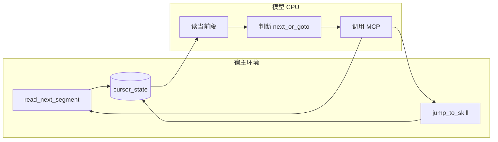

# Skills 脚本化分段执行（双 MCP + 状态）— 设计说明

> 本文档描述：将 skills 当作可跳转的「脚本」，通过多轮对话按需披露片段以降低上下文占用，并支撑超长复杂任务。  
> 可拷贝到任意仓库中作为设计与实现参考。

**版本说明**：与 Cursor 计划「Skills 分段执行可行性」内容一致；落地路径请替换为你的项目目录。

---

## 目标对齐：以「省上下文 + 超长复杂任务」为导向，这套东西合理吗？

**总体判断：合理，且与问题匹配。** 你的两个目标在机制上对应两件不同的事：

1. **减少上下文开销（相对「一次性整份 skill」）**  
   按需拉段 / 跳转，只让 **当前段 + 必要元数据** 进入窗口，和 Anthropic 说的 *progressive disclosure* 同路，**方向正确**。注意：若每轮都把完整历史原样堆进模型，**多轮本身也会涨上下文**——需要 **段外状态**（服务端会话、检查点、任务变量摘要）和/或 **定期压缩历史**，否则长任务后期仍可能被对话拖垮。

2. **超长复杂任务**  
   仅靠「脚本式 skill」能约束 **流程与知识加载顺序**，但复杂任务通常还需要：**可持久化的工作态**（已完成子步骤、中间产物路径、失败重试点）、以及 **非 LLM 的确定性步骤**（脚本、测试、格式化工具）。脚本化 skill 适合当 **编排层**；**执行层**仍建议该用代码/工具就用，避免所有逻辑都挤在自然语言段里。

**结论**：以 stated 目标为准，**这套设计是说得通的**；要真正吃到红利，**协议（next/goto/finish）、服务端状态、对话历史策略、编排/执行分层、轨迹与评测** 不是可选项——细则见下文 **「工程优化清单」** 与 **「落地步骤」**。

---

## 结论：可行，且与常见 agent 模式同构

你的模型可以概括成：

- **AI = CPU**：每轮只看到「当前段 + 少量上下文（任务、变量、上一步结果）」，根据段内指令决定下一步。
- **Skills = 脚本**：每个 skill 被切成有序段（segment），段内是自然语言/结构化步骤；**跳转**相当于 `JMP label` 或 `CALL other_skill`。
- **两个 MCP**：足够表达 **顺序前进** 与 **任意跳转**（图灵意义上你还需要「停机/完成」——通常用第三种信号：不再调用 MCP、或调用 `finish`，但也可约定「某段末尾无工具调用即结束」，只是可观测性更差）。

因此这不是全新范式，而是 **「带 PC 的 tool-use 循环」** 或 **「可跳转的 prompt 虚拟机」**，与 ReAct / tool-calling agent、以及「把长文档分页检索」的思路一致。

---

## 为什么「两个 MCP」在概念上够用

| 能力 | 映射 |
| --- | --- |
| 顺序执行 | `read_next_segment`：PC++，返回下一段文本 |
| 分支/子流程 | `jump_to_skill(skill_id, segment?)`：设置 PC |
| 子 skill 返回（若需要） | 要么 skill 设计成 DAG/无返回栈；要么 **扩展**为第三个 MCP `return_from_skill` 或在 `jump` 里带「调用栈」——纯两个工具时，**调用栈要放在服务端状态里** |

**要点**：若你要 **真正的子程序调用 + 返回**，仅靠「跳转」容易丢返回地址；可行做法是 **在 MCP 服务端维护调用栈**（`jump` 时 push，`read_next` 在子 skill 结束后 pop），这样对外仍可以是两个工具，或把「带栈的 jump」封装进一个 `navigate` 工具（参数区分 next/goto/return）。

---

## 与「面向 skills 编程」的关系

- **没有**像「面向对象」那样被广泛定型的工业标准术语，但 **实践上已大量存在**：长 system prompt 分块、RAG 分页、workflow 引擎、以及各类「agent 按 playbook 执行」框架，都是同一族想法。
- 把 **控制流显式化**（段 + PC + 跳转），比「整份 SKILL.md 一次性加载」更接近 **脚本/VM**，对 **超长 skill** 和 **多 skill 组合**更友好。

---

## 业界类似思路与实现（调研摘要）

下面按「和你有多像」分组；**没有完全相同的「仅两个 MCP：next + jump」公开标准产品**，但 **动机与机制高度同构**的实现很多。

### 1. 最接近：Anthropic Agent Skills 的「渐进式披露」（Progressive Disclosure）

- **机制**：Skill 分三层加载——L1 仅 YAML 元数据（发现用）、L2 触发后再读 `SKILL.md`、L3 按需读附属 md/脚本；强调 **按需进入上下文**，大包内容留在文件系统里。
- **实现载体**：在 Claude 产品里是 **代码执行环境 + 文件系统 + bash 读文件**，不是「两个 MCP」，但语义上等于 **由模型决定下一步读哪一段/哪个文件**。
- **参考**：[Agent Skills 概述](https://docs.anthropic.com/en/docs/agents-and-tools/agent-skills/overview)（文中明确写了 *progressive disclosure* 与三级加载表）。

### 2. 控制流在宿主侧：工作流图 / 状态机（「PC 与跳转」在引擎里）

- **代表**：LangGraph 等——用 **State + Nodes + Edges** 描述「下一步走哪个节点」；边可以是条件分支；状态可持久化（checkpoint）。这是 **宿主维护 PC/跳转**，LLM 往往是某一类 node 的内部逻辑，而不是「整台机器只有两段 MCP」。
- **参考**：[LangGraph Graph API overview](https://langchain-ai.github.io/langgraph/concepts/low_level/)（*nodes do the work, edges tell what to do next*）。

### 3. 检索与文档：分块 + cursor/offset（「下一段」的工程化版本）

- **机制**：长文档切成 chunk，API 用 `cursor`/`offset`/`limit` 拉下一页；agent 侧常见「先检索再读扩展上下文」——和 `read_next_segment` 同属 **分页式暴露内容**。
- **参考**：各类 RAG 文档 API；与 **skill 段**的差别主要是 **内容是否结构化成语义段 + 是否带 skill 级 manifest**。

### 4. 经典 agent 循环：ReAct / tool-use（「CPU 每步观察-决策-行动」）

- **机制**：模型每轮可选调用工具；**顺序、分支**由 prompt + 工具结果隐式塑造。你的方案是把其中 **两个工具专门化成 next/goto** 并外加 **服务端 PC**，从而 **更强约束、更可审计**。

### 5. Cursor / Codex 生态中的 Skills

- **现状**：多为 **触发后整份或大块 SKILL 进入对话**（+ 用户 rules），偏「文档化 playbook」；**公开协议层面**一般 **没有**「必须用 MCP 逐段拉取」的标准——但 **作者侧**可以把长 skill 拆成多文件、在正文里写「需要时再读某某段」，效果上接近 **手工 progressive disclosure**。

### 调研结论

- **有类似思路**：Anthropic 官方 Skills 架构、LangGraph 类工作流、RAG 分页、ReAct 工具循环，都与「分段、按需、显式下一步」之一或多个维度重合。
- **极少见到**「产品化且仅暴露 next + jump 两个 MCP、skills 纯脚本 VM」的 **公开标准实现**；更像是 **可组合出的私有协议**（在你自己的 MCP 服务里实现 PC/栈即可）。

---

## 主要风险与对策（决定「能不能用得稳」）

1. **模型不遵守控制流**（跳过段、乱跳转）  
   - **对策**：要求每轮输出 **固定 JSON**（例如 `{ "action": "next"|"goto", "target": "...", "reason": "..." }`），且 **只有**在解析合法后才由宿主执行 MCP；非法则重试或降级为「读当前段重答」。

2. **段与段之间状态丢失**  
   - **对策**：服务端维护 **session 状态**（变量、PC、调用栈、已完成检查点）；每段可注入「当前状态摘要」。

3. **调试困难**  
   - **对策**：记录 **执行轨迹**（段 id、工具入参、模型决策），与单元测试式的「黄金路径」用例。

4. **与安全边界**  
   - MCP 只返回 **允许的 skill 片段**，避免任意文件读取；跳转目标 **白名单** 或基于 manifest。

---

## 工程优化清单（落实「省上下文」与「超长复杂任务」）

以下条目把 **必做优化** 收拢为可实现的规格，避免「分段了但对话历史把 token 吃光」或「长任务无状态可恢复」。

### 1. 对话历史策略（与分段披露配套）

- **问题**：skill 按段披露能减少 **skill 正文** 占用，但若每轮附带 **完整用户/助手往返**，长任务后期上下文仍会膨胀。
- **原则**：把 **可复用事实** 迁出对话，放进 **会话状态**；对话里只保留 **短窗口 + 结构化快照**。
- **建议规格（写入宿主或 MCP 侧配置）**：
  - **每轮固定注入块**（由宿主拼装，不必依赖模型回忆）：
    - 用户原始目标（或经确认的版本）；
    - **状态快照**（见下节）：`pc`（skill id + segment id）、调用栈顶、关键变量、未完成子任务列表；
    - **当前段正文**（本回合刚从 MCP 拉取的片段）。
  - **助手侧历史裁剪**：
    - 保留最近 `N` 轮「自然语言+工具调用」用于连贯性；更早轮次 **折叠** 为一段 **机器友好摘要**（由模型或规则生成：已完成步骤、当前阻塞、已确认决策）。
  - **触发摘要的时机**（任选或组合）：每 `K` 轮、token 估计超阈值、进入新 skill、用户显式 `/compact`。
  - **不要依赖** 模型在长对话末尾仍能准确回忆 50 轮前的细节；**以快照为准**。

### 2. 外部化状态与检查点（长任务刚需）

- **会话状态**（建议 MCP 或独立 store 持久化，`session_id` 关联）至少包含：
  - `skill_id`、`segment_id`、可选 **调用栈**（支持子 skill 返回）；
  - **任务变量**：键值或小型 JSON（分支结果、用户选择、环境标识）；
  - **进度检查点**：已完成段 id 列表或阶段名（用于幂等与恢复）；
  - **产物指针**：仓库路径、生成文件路径、最近一次命令退出码等（仅存指针与摘要，不存大段日志全文）。
- **恢复语义**：用户中断或失败后，新会话可带同一 `session_id`（或导入快照）**从检查点继续**，无需重放整段对话。
- **与 skill 段的关系**：段内指令应引用 **状态键名**（例如「将结论写入 `state.findings`」），由宿主在调用 MCP 前后读写，避免把大块中间结果反复塞进 prompt。

### 3. 编排层 vs 执行层（复杂任务要稳）

- **编排层**：分段 skill 负责 **何时加载哪段、何时跳转、何时征求用户确认**——偏流程与知识。
- **执行层**：格式化、批量重命名、测试跑通、确定性转换等，优先 **脚本 / 既有 CLI / 其它 MCP 工具**；skill 段只写「调用什么、期望什么输出、如何解析进状态」。
- **写作规范**：在 manifest 或 SKILL 作者指南中写明：**禁止**在段里堆可执行的大段伪代码替代真实脚本；**长逻辑** 放到 repo 内脚本，段内仅 **调用约定**。

### 4. 控制流与可观测性（与优化叠加）

- **显式 finish**：除 `next`/`goto` 外，定义 **完成/暂停** 动作（工具或 JSON 字段），便于宿主停轮次、打检查点、触发摘要。
- **轨迹日志**：段 id、决策 JSON、工具入参、状态 diff（可落盘），用于调试 **为何跳错段** 与回归 **黄金路径**。

### 5. 安全与治理（长任务放大风险）

- **跳转与段内容** 均来自 manifest 白名单；禁止工具参数直接拼任意路径读盘。
- **敏感变量**（密钥、token）不进状态快照明文；仅存「已配置」布尔或 vault 引用。

---

## 与「少 MCP」的权衡

- **两个 MCP** 清晰、易教给模型。
- 也可 **合并为一个** `skill_step(action, ...)`，减少工具描述长度，有时能降低选错工具的概率——属于产品细节，不改变可行性。

---

## 落地步骤（任意项目中试用）

建议按下面顺序推进（前四项与上文 **工程优化清单** 一一对应）：

1. **Skill 分段规范**：manifest（skill id、段列表、每段 id、可选元数据）；作者指南中写明 **编排层/执行层** 分工。
2. **MCP 服务**：内存或文件后端，维护 `session_id -> { skill, segment_index, stack, variables, checkpoints, artifact_refs }`。
3. **宿主 prompt + 每轮注入**：决策 JSON 协议；每轮注入 **目标 + 状态快照 + 当前段**；实现 **历史窗口 + 条件摘要**。
4. **显式生命周期**：`finish` / `pause`、检查点持久化、可选 **同 session 恢复**。
5. **评测**：黄金路径覆盖 next/goto/子 skill；**中断后恢复**；一轮「长对话」压测下 token 曲线是否符合预期。

---

## 实施清单（Todos）

- [ ] **spec-protocol**：定义段格式、manifest、每轮决策 JSON（next/goto/finish）与错误恢复策略
- [ ] **mcp-state**：设计 MCP 会话状态：PC、调用栈、任务变量/检查点、每轮注入摘要的字段规范
- [ ] **history-policy**：制定对话历史策略：何时摘要、保留窗口、每轮注入块（任务目标/状态快照/当前段）
- [ ] **orchestration-vs-exec**：划分编排层（skill 段）与执行层（脚本/测试/格式化工具），写入 skill 写作规范
- [ ] **pilot-skills**：选 1–2 个真实 skill 切成段，做黄金路径评测（顺序、跳转、子 skill、中断恢复）

---

## 总结

- **思路可行**，且与现有 agent + tools 生态一致；本质是 **分段加载 + 显式 PC/跳转 + 服务端状态**，并必须用 **对话历史策略 + 外部状态/检查点** 才能兑现「省上下文、撑长任务」。
- **两个 MCP** 对「顺序 + 跳转」足够；若需要 **子程序返回**，建议在服务端加 **调用栈**（对外仍可不增加第三个工具，取决于你是否把 return 合进 jump 的语义）。
- **编排层（skill 段）+ 执行层（脚本/工具）** 拆分，避免复杂逻辑全堆在自然语言段里。
- **「面向 skills 编程」** 更像一种 **工程化执行模型**，而非已有标准名词；价值在于 **控上下文、可组合、可记录**，代价是 **协议、状态、历史策略与评测** 要做扎实。
