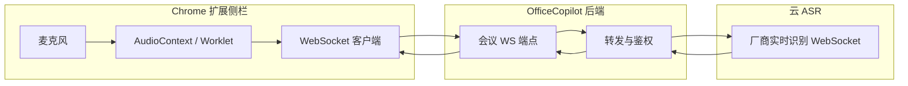

# 会议实录：流式 ASR + WebSocket / gRPC 方案备忘

> 供后续调研与落地参考。当前扩展侧「固定时间片 PCM→WAV + 多次 POST `/api/transcribe`」仍受分片质量、延迟与上游偶发空音频等限制；**流式 ASR** 更接近飞书/Teams/讯飞等产品的架构。

---

## 1. 目标与现状对比

| 维度 | 现状（HTTP 分片转写） | 流式 ASR |
|------|----------------------|----------|
| 音频上行 | 周期性整文件（WAV/WebM）POST | 小帧连续发送（PCM/Opus 等） |
| 识别结果 | 每文件一次 final | partial + final，可边听边出字 |
| 并句/VAD | 客户端自己切段 | 多由 **服务端 VAD + 解码器** 处理 |
| 延迟 | 块长越大延迟越高 | 通常更低、更平滑 |

---

## 2. 推荐总体架构（与本仓库衔接）

- **浏览器**：采集音频 → 按固定帧长（如 20ms～200ms）发送 **二进制帧**；展示服务端下发的 **partial / final** 文本。
- **本机后端**（推荐）：  
  - 作为 **信令与鉴权网关**：扩展只连 `wss://127.0.0.1:8765/...`，API Key 不暴露给扩展。  
  - 维护「浏览器会话 ↔ 云端 ASR 连接」的桥接；将云端 **final 句** 写入现有 [`MeetingTranscriptStore`](backend/Services/MeetingTranscriptStore.cs)（JSONL），与现在 `POST /api/meeting-transcript/segment` 效果一致。
- **可选**：扩展直连云厂商 WebSocket（实现简单，但密钥与 CORS/域名限制更难处理）。

**gRPC**：部分云厂商提供 **gRPC 流式识别**（如 Google Cloud Speech-to-Text v2 streaming）。浏览器 **不能原生 gRPC**，需 **后端代理** 或 **gRPC-Web**。因此「Chrome 扩展 + 本机服务」路径下，**WebSocket 更自然**；gRPC 适合 **服务端之间** 或 **桌面端/移动 SDK**。

---

## 3. 阿里云百炼（DashScope）实时语音 — 调研入口

当前项目 STT 若走百炼，常见有两类：

1. **兼容 OpenAI 的 `chat/completions` + 整段音频**（你们已在用）— **非流式**，适合短文件。
2. **实时语音识别 WebSocket API** — **流式**，需单独对接。

调研时请以官方最新文档为准，关键词建议：

- 「大模型服务平台百炼 实时语音识别」
- 「Paraformer 实时语音识别 WebSocket」
- 「Fun-ASR 实时」
- 「通义千问 实时语音识别」

典型特征（具体 URL、模型 id、事件名以文档为准）：

- 连接 **`wss://...`**，**Bearer Token** 鉴权。
- 消息形态：**JSON 控制帧**（开始任务、结束任务）+ **二进制音频帧**。
- 下行：**中间结果 / 最终结果**、时间戳、句边界等。

**注意**：北京 / 新加坡等地域 endpoint 不同；国际站与阿里云主站可能分文档。

---

## 4. 与本仓库模块的映射

| 模块 | 流式改造时的角色 |
|------|------------------|
| `chrome-extension/sidepanel.js` | 会议监听改为 **WS 发送音频帧**；收 **文本增量** 更新预览 |
| `chrome-extension/meeting-live.js` | 可继续 **HTTP 轮询 segments**；或改为 **同一 WS 推送**（二选一） |
| `backend` 新增 `Map`/`Hub` | 例如 `GET /ws/meeting-transcribe?sessionId=&token=` |
| `MeetingTranscriptStore` | **仅在 final 句**（或你们定义的「段」）调用 `AppendSegmentAsync` |
| `SessionContextFilter` | 已排除会议读盘工具的 `sessionId` 注入；流式方案保持不变即可 |

---

## 5. 协议设计备忘（后端 ↔ 扩展）

可在第一版自行约定 JSON 消息（示例，非定稿）：

**扩展 → 后端**

- `{"type":"start","sessionId":"meeting_xxx","sampleRate":16000,"format":"pcm_s16le"}`  
- 随后连续 **Binary** PCM 帧。

**后端 → 扩展**

- `{"type":"partial","text":"..."}`  
- `{"type":"final","text":"...","segmentIndex":12}` — 收到后后端写 JSONL + 推给实录页（或依赖轮询）。

结束：

- 扩展发 `{"type":"stop"}` 或关闭 WS；后端 `finish-task` 到云端并刷盘尾句。

---

## 6. 风险与注意点

- **采样率 / 声道**：云端常要求 **16k 或 48k 单声道**；需在客户端 **重采样**（如 OfflineAudioContext 或 WASM / worklet）。
- **成本与限流**：流式连接时长、并发连接数看各厂商配额。
- **断线重连**：会议长时需 **任务 id** 续传或重新开始并合并文本（产品策略）。
- **隐私**：音频经本机服务再出网；若必须 **纯本地**，需换 **本地 Whisper / Vosk** 等，与「百炼流式」路径不同。

---

## 7. 建议的明天阅读顺序

1. 打开阿里云百炼文档，确认 **当前推荐的实时模型名** 与 **WebSocket URL**。  
2. 看一遍 **鉴权、run-task / finish-task**（或等价）流程与 **音频编码格式**。  
3. 在本仓库画一条 **最小闭环**：扩展录 10 秒 → 后端桥接 → 云端 → 控制台打印 final。  
4. 再接到 `MeetingTranscriptStore` 与 `meeting-live` 轮询。

---

## 8. 参考链接（请自行打开最新版）

- [阿里云大模型服务平台百炼 - 实时语音识别](https://help.aliyun.com/zh/model-studio/real-time-speech-recognition)（入口可能随产品更名调整）  
- [Paraformer 实时语音识别 WebSocket API](https://help.aliyun.com/zh/model-studio/developer-reference/websocket-for-paraformer-real-time-service)  

若链接变更，在帮助中心内搜索 **「实时语音识别 WebSocket」** 即可。

---

*文档生成自 Taskly 仓库讨论；实现以官方文档与你们安全策略为准。*
