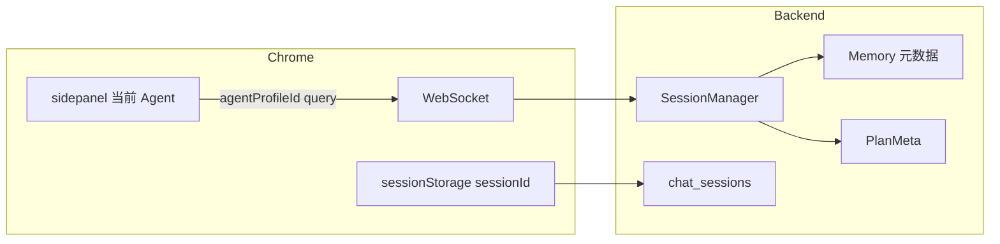

# 多 Agent 配置（身份与归属）— 执行计划

> **仓库**：Taskly / OfficeCopilot  
> **权威端**：以 `chrome-extension/` 为准（多端对齐规则见 `.cursor/rules/multi-client-chrome-canonical.mdc`）。  
> **JSON**：camelCase + `JsonCtx`（见 `.cursor/rules/api-json-contract.mdc`）。  
> **明确不做**：按 Agent 绑定不同对话模型；全局仍只用 `AppConfig.activeModelId`。

在新 Cursor 窗口中：打开本仓库根目录，将本文件 `**@docs/多Agent配置-执行计划.md`** 发给 Agent，或使用下方一键提示词。

---

## 一键提示词（复制到 Agent）

```text
请严格按仓库内 @docs/多Agent配置-执行计划.md 中的勾选清单顺序实现：
- 分阶段完成：A 配置与协议 → B 后端会话与存储 → C Chrome 侧栏与设置 → D 测试；每阶段自测后再进入下一阶段。
- 切换 Agent 时必须新开 sessionId 并重连 WS（见阶段 C）。
- 不得实现「每个 Agent 绑定不同对话模型」；全局仍用 AppConfig.activeModelId。
- 完成后在回复中列出修改的文件路径与手工验证步骤。
```

---

## 目标摘要

- **稳定 Agent 配置**（`id`、`displayName`、可选 `systemPromptSuffix`）替代**活动标签标题**，作为记忆元数据、计划 `createdByDisplayName`、历史会话归属的主来源。
- **切换当前 Agent → 自动新开对话**（新 `sessionId`），避免同一持久化会话混用不同 Agent。
- **对话模型全局唯一**：仅 `activeModelId`。

## 数据流（参考）




---

## 阶段 A — AppConfig 与 WS 协议

### A1 — `AppConfig` 与序列化

- 在 `[backend/ConfigService.cs](../backend/ConfigService.cs)` 的 `AppConfig` 增加：
  - `agentProfiles`：`List<AgentProfileEntry>`（至少 `id`、`displayName`；可选 `systemPromptSuffix`）。
  - `activeAgentProfileId`（可选默认，如 `"default"`）；加载时若列表非空且 id 无效则回退第一项。
- 在 `[backend/MessageRouter.cs](../backend/MessageRouter.cs)` 的 `JsonCtx` 源生成注册处增加 `AgentProfileEntry` / 列表类型；`POST /api/config` 与落盘反序列化能读写 camelCase。
- 更新 `[backend/appsettings.Example.json](../backend/appsettings.Example.json)` 或项目内配置示例（若惯例有）。

### A2 — WebSocket 握手与 `SessionManager`

- 在 `[backend/Program.cs](../backend/Program.cs)` WS 分支：解析 query `**agentProfileId**`；校验非空则绑定到会话。
- 在 `[backend/SessionManager.cs](../backend/SessionManager.cs)`：`SessionEntry` 增加 `AgentProfileId`、`AgentDisplayName`（或等价命名）；`Add(...)` 或后续写入；提供读取方法。
- **与 tab 标题解耦**：`set_context` 的 `pageTitle` **不要**再覆盖「Agent 展示名」；页面标题仅作页面上下文/日志（可单独字段或注释明确的 `DisplayName` 语义拆分）。

### A3 — `set_context` 与 `WsMessage`

- `[backend/MessageRouter.cs](../backend/MessageRouter.cs)`：`WsMessage` 与前端字段一致。
- `[backend/Program.cs](../backend/Program.cs)` `case "set_context"`：按 A2 语义处理，不覆盖 Agent 展示名。

---

## 阶段 B — 记忆、计划、SQLite 会话

### B1 — Memory / Plan 归属

- `[backend/Plugins/MemoryPlugin.cs](../backend/Plugins/MemoryPlugin.cs)`：`save_memory` 的 `agentName` 元数据改为 **Agent 展示名**（或 id+名策略），来自 `SessionManager`，不用 tab title。
- `[backend/Plugins/PlanPlugin.cs](../backend/Plugins/PlanPlugin.cs)`：`createdByDisplayName` 同上。
- `[GET /api/plans](../backend/Program.cs)`：`agentName` 查询与新的展示名/id 一致（旧计划数据可保留原字符串）。

### B2 — `chat_sessions` 持久化

- `[backend/Services/Chat/SqliteChatSessionStore.cs](../backend/Services/Chat/SqliteChatSessionStore.cs)`：`chat_sessions` 增加 `agent_profile_id`（TEXT，可空）；在 `EnsureInitialized` 中迁移。
- `SaveFromHistoryAsync`：写入当前会话的 `agent_profile_id`（从 `SessionManager` / `SessionContext` 等与 `sessionId` 打通）。
- `[ChatSessionDtos.cs](../backend/Services/Chat/ChatSessionDtos.cs)`、`[IChatSessionStore.cs](../backend/Services/Chat/IChatSessionStore.cs)`：`List` 支持 `agentProfileId` 过滤；`[Program.cs](../backend/Program.cs)` `GET /api/chat-sessions` 增加 query 参数。

### B3 — 可选：system 注入

- 若实现 `systemPromptSuffix`：在 `[backend/ChatService.cs](../backend/ChatService.cs)`（或现有 system 拼装点）按 profile 追加，与 `[docs/提示词清单.md](./提示词清单.md)` 分层一致。

---

## 阶段 C — Chrome（权威端）

### C1 — 存储与 WS URL

- `[chrome-extension/sidepanel.js](../chrome-extension/sidepanel.js)`：`chrome.storage.local` 存 `activeAgentProfileId`；`connect()` 的 WS URL 附带 `agentProfileId`。
- **切换 Agent**：更新 storage → **新 `sessionId`** → 清空消息区 → 关闭并重连 WS。

### C2 — UI

- 侧栏：当前 Agent 选择器；切换时执行 C1。
- `[chrome-extension/options.js](../chrome-extension/options.js)`、`[options.html](../chrome-extension/options.html)`：维护 `agentProfiles`（增删改），保存走 `POST /api/config` 与现有配置流一致。

### C3 — 验收（手工）

- 切换 Agent 后 sessionId 变新、历史不串。
- 记忆/计划归属与设置页筛选符合预期。
- `GET /api/chat-sessions?agentProfileId=` 与侧栏当前 Agent 一致。

---

## 阶段 D — 测试

- 单元：可测逻辑放入 `[backend.Tests/Unit](../backend.Tests/Unit)`。
- 集成：`GET /api/chat-sessions` 新 query → `[backend.Tests/Integration](../backend.Tests/Integration)`。
- `dotnet test backend.Tests/backend.Tests.csproj` 通过。

---

## 参考文件清单


| 区域     | 路径                                                                     |
| ------ | ---------------------------------------------------------------------- |
| WS 握手  | `backend/Program.cs`                                                   |
| 会话     | `backend/SessionManager.cs`                                            |
| 配置     | `backend/ConfigService.cs`、`backend/MessageRouter.cs`（JsonCtx）         |
| 记忆/计划  | `backend/Plugins/MemoryPlugin.cs`、`PlanPlugin.cs`                      |
| 历史会话   | `backend/Services/Chat/SqliteChatSessionStore.cs`、`ChatSessionDtos.cs` |
| Chrome | `chrome-extension/sidepanel.js`、`options.js`、`options.html`            |


---

## 与 `.cursor/plans` 的关系

仓库内另有 `[.cursor/plans/multi-agent-profiles.plan.md](../.cursor/plans/multi-agent-profiles.plan.md)`（带 Cursor Plans 用 YAML 头）。**内容与本文一致**时，任选其一 `@` 引用即可；新开窗口只用本文路径最直观。

---

**变更说明**：不包含「按 Agent 选模型」；多 Agent 仅覆盖身份、归属与可选 system 后缀。