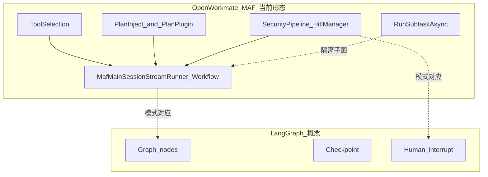

# OpenWorkmate：开源 AI 借鉴与落地路线

本文档落实「开源 AI 工具调研」计划中的三项结论：**优先聚焦主线**、**可汉化提示词模式（映射到本仓库工具）**、**MAF/MEAI 编排与 LangGraph 式状态机的对照评估**。  
与 [提示词清单.md](./提示词清单.md)、[architecture-dimensions.md](./architecture-dimensions.md)、[maf-migration-baseline.md](./maf-migration-baseline.md) 配合阅读。（原 `PROJECT_PLAN.md` 已过时删除，里程碑以代码与基线文档为准。）

---

## 1. 优先聚焦主线（pick-focus）

在 **不引入 Python 栈、不大重构** 的前提下，建议将可用性提升的主线定为：

| 优先级 | 方向 | 理由 |
|--------|------|------|
| **P0** | **提示词**（system + 端身份 + 动态块） | 杠杆最大；仓库已有集中归档与 `ToolResultEchoSystemInstruction` 等机制，迭代成本最低。 |
| **P0** | **人机回路（HITL）** | 已有 `HitlManager`、`confirm_response`、`UserOptionsManager` / `ask_options`；对齐业界「interrupt → 人类决策 → 恢复」可减少误操作。 |
| **P1** | **流式与取消** | `StreamCancelService`、`stop` 消息与 MAF/MEAI 主会话流式路径已贯通；继续打磨中断与状态提示即可。 |
| **P2** | **知识库 / 长期记忆（RAG）** | `ChatService` 已支持知识库注入与记忆检索；作为**增强线**，在 P0 稳定后再做召回质量与评测。 |

**结论**：当前迭代主线 = **提示词 + HITL**；RAG 不作为同一冲刺的阻塞项。

---

## 2. 从开源生态「抽取—汉化—映射」的提示词模式（prompt-mining）

下列模式来自常见 Agent 框架的公开实践（ReAct、多角色、人机节点等），**不是逐字照抄某一仓库**，而是提炼为可写入本项目的指令块；落地时请写入 `AiConfig.SystemPrompt`、或 `ChatService.GetClientTypeIdentitySuffix`、或计划/子任务专用 system（与 [提示词清单.md](./提示词清单.md) 中章节对应）。

### 2.1 ReAct 式「意图 → 工具 → 复述」（对齐 LangChain/LangGraph 示例中的工具循环思想）

**英文常见结构**：Thought → Action → Observation → …

**OpenWorkmate 映射文案（建议中文，可并入 system 或紧接 `ToolResultEchoSystemInstruction`）：**

- 在调用工具前，用**一句**说明本轮目标（用户可见或仅作约束均可，视产品而定）。
- 工具返回后，**必须**用自然语言整理结果；与现有常量一致——见 `ChatService` 中 `ToolResultEchoSystemInstruction`（工具结果须在正文复述）。

**与本仓库工具名的对应关系示例**：

| 开源模式中的环节 | OpenWorkmate 中的落点 |
|------------------|-----------------|
| Action（调用外部能力） | `Excel_*`、`Word_*`、`Browser_*`、`CurrentDocument_*`、MCP 工具等 |
| Observation（结构化中间结果） | `accurate_data_write` / `accurate_data_read`（大数据不塞满上下文） |
| 需要用户选路径 | `ask_options`（`UserOptionsManager`） |

### 2.2 CrewAI 式「角色 / 目标 / 约束」（多 Agent 文档常见）

**可借鉴结构**：每个角色有 *Role、Goal、Backstory*。

**OpenWorkmate 映射**：已由 **clientType 身份后缀** 承担「角色 + 边界」，见 `ChatService.GetClientTypeIdentitySuffix`（chrome / office-word / office-excel / wps 等）。增强时可为**新端**增加一行后缀，而不是再引入第二套 Agent 运行时。

**可选补充句（写入各端后缀或全局 system）**：

- 「你只负责上表所列能力；若用户需求属于另一客户端，明确说明并建议切换端。」（与现有端分工文案一致即可缩短为一条规则。）

### 2.3 AutoGen / LangGraph 式「人类在环」（HITL）

**可借鉴点**：在**敏感或不可逆操作前**暂停，等待人类输入后再继续。

**OpenWorkmate 映射**：

| 概念 | 实现位置 |
|------|-----------|
| interrupt | `SecurityPipeline` + `HitlManager`（需用户确认的操作） |
| resume | WebSocket `confirm_response` |
| 选项式确认 | `ask_options` / `ask_options_response` |

**建议在提示词中增加一条（若尚未显式写出）**：当存在多种合规路径或缺少关键参数时，**优先** `ask_options` 让用户选择，而不是猜测默认。

### 2.4 Open Interpreter 式「风险与输出边界」

**可借鉴点**：沙箱、输出长度、危险命令二次确认。

**OpenWorkmate 映射**：CLI / 系统类工具继续与 `SecurityPipeline`、HITL 配置联动；提示词侧可强调：「对可能修改文件或执行命令的操作，先确认范围再执行。」

### 2.5 计划拆解（与 Plan 插件一致）

**可借鉴点**：复杂任务先产出可执行步骤，再逐步执行。

**OpenWorkmate 映射**：`PlanPlugin.create_plan`、绑定 `planId` / `planCurrentStepIndex` 时在 `RunStreamChatContextPhasePart2Async` 注入的「当前步骤」system 块。开源项目中的「Planner 节点」对应这里的 **计划生成 + 分步注入**，无需另起一套图执行引擎。

---

## 3. MAF/MEAI 与 LangGraph 状态机：是否需要「轻量 Planner 状态」（maf-patterns）

### 3.1 当前架构中已覆盖的「状态」

| 能力 | 代码/模块 | 说明 |
|------|-----------|------|
| 会话与对话历史 | `SessionState` + `List<ChatMessage>` (MEAI) | 多轮对话与摘要、Compaction 等 |
| 工具范围裁剪 | `ToolCatalogIndex` + `search_available_tools` / `activate_tools` + 本轮 `ChatOptions.Tools` | 降低无关工具干扰 |
| 计划与分步 | `IPlanStore` + `PlanPlugin` + system 动态注入 | 绑定计划 ID、当前步骤文本注入 system |
| 子任务隔离 | `RunSubtaskAsync` | 子代理内多轮工具不污染主会话 |
| 人机确认 | `HitlManager` + `SecurityPipeline` | 拦截 → 前端确认 → 继续调用 |
| 流式与取消 | `HandleChatStream` + `StreamCancelService` | `stop` 取消本轮生成 |

上述组合在语义上已覆盖 LangGraph 常见图中的 **路由（工具选择）、分支（如绑定计划时的上下文差异）、人类节点（HITL）、子图（子任务）**，只是以 **C# + MAF `ChatClientAgent` / Workflow 内建工具循环** 实现，而非 Python 中的显式 `StateGraph`。

### 3.2 结论：是否需要额外「Planner 状态机」对象？

- **短期（快速提升可用性）**：**不必**新增与 LangGraph 同构的通用状态机类型；优先通过 **提示词**、**计划绑定**、**HITL** 收紧行为即可。
- **中长期（若出现以下痛点再考虑加轻量状态）**：
  - 需要**持久化检查点**（崩溃恢复、跨进程恢复会话）；
  - 需要**严格限制单轮对话中工具调用次数/阶段**（例如「最多 N 次工具调用后必须向用户汇报」），且仅靠模型自律不可靠；
  - 需要**可观测的显式阶段字段**（如 `GatheringInfo` → `Executing` → `Reporting`）供前端展示固定进度。

若引入轻量状态，建议形态为：**会话级 small DTO**（枚举阶段 + 计数器 + 可选 `planId` 指针），在 `ChatService` 主会话入口维护，而不是引入第二套 Agent 运行时。

### 3.3 与 LangGraph 的对应关系（概念图）

---

## 4. 参考仓库（只读借鉴，不绑定依赖）

- [microsoft/agent-framework](https://github.com/microsoft/agent-framework) / **Microsoft.Agents.AI** — 与当前主会话编排一致（概念上亦可对照 [microsoft/semantic-kernel](https://github.com/microsoft/semantic-kernel) 文档中的工具循环思想）。
- [langchain-ai/langgraph](https://github.com/langchain-ai/langgraph) — 状态图、HITL 概念。
- [microsoft/autogen](https://github.com/microsoft/autogen) — 多 Agent 与人类介入模式。
- [crewAIInc/crewAI](https://github.com/crewAIInc/crewAI) — 角色与任务描述结构。
- [modelcontextprotocol/specification](https://github.com/modelcontextprotocol/specification) — 工具与错误语义。
- [openinterpreter/open-interpreter](https://github.com/openinterpreter/open-interpreter) — 本地执行风险与 UX。
- [run-llama/llama_index](https://github.com/run-llama/llama_index) — 若加强 RAG 管线时再对照。

---

## 5. 下一步可执行项（与主线对齐）

1. 在 **P0** 上：审阅 `AiConfig.SystemPrompt` 与 `ToolResultEchoSystemInstruction`，补全「多路径时用 `ask_options`」等短规则（具体措辞以产品为准）。
2. 在 **P0 HITL** 上：核对敏感操作是否均走 `SecurityPipeline` / 配置，避免静默执行。
3. 在 **P2 RAG** 上：仅在需要时增加 chunk/评测，参考 LlamaIndex/Haystack **数据流**，而非替换后端语言。

以上项完成后，再评估第三节中的「轻量 Planner 状态 DTO」是否值得引入。
