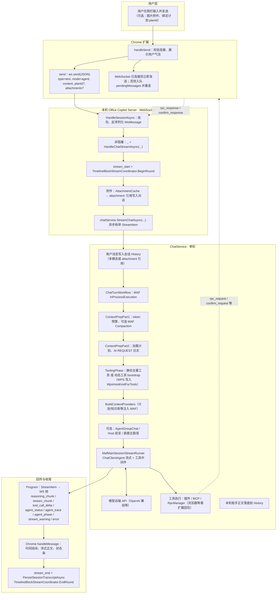
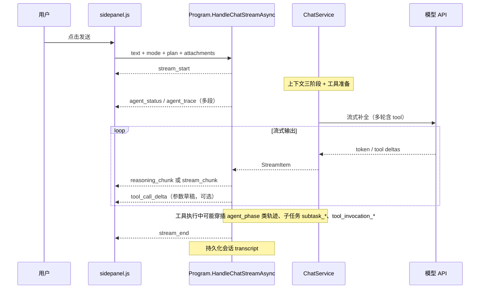

# 用户发出一条请求后的端到端时间线

本文从**时间先后**描述：用户在侧栏发送一条消息后，数据如何流经 **Chrome 扩展 → 本机 WebSocket → 后端会话与 MAF → 再经 WebSocket 回到时间线 UI**。  
**规范实现以 Chrome 为准**（`chrome-extension/`）；Office / WPS 亦连同一套 WebSocket，细节可能略有差异。

实现锚点：`chrome-extension/sidepanel.js`（`handleSend` / `send` / `handleMessage`）、`backend/Program.cs`（`HandleSessionAsync` / `HandleChatStreamAsync`）、`backend/ChatService.cs` + `ChatService.StreamPhases.cs`、`backend/Services/Chat/Executors/ChatTurnWorkflow.cs`、`backend/Services/Maf/MafMainSessionStreamRunner.cs`。

---

## 1. 自上而下：主流程（逻辑分层）

**要点简述**

- **为何 `HandleChatStreamAsync` 不 `await` 挂在默认分支**：工具若通过 `rpc_request` 要求扩展在同一 WebSocket 上回 `rpc_response`，若阻塞收包循环会死锁；因此聊天流在后台跑，收包循环继续服务控制类消息（见 `Program.cs` 注释）。
- **时间线上的块**：服务端 `TimelineBlockStreamCoordinator` 为 `reasoning_chunk` / `stream_chunk` 等分配 `blockSeq` / `blockKind`，前端按序渲染为「一轮」内的子块；`agent_status` / `agent_trace` 用于活动说明与结构化轨迹。
- **配置分叉**：`SemanticKernel:UseAgentGroupChatMainSession` 为真时走 `MafAgentGroupChatSessionRunner`；否则走主路径 + 可选 `UseHostPreambleAgent` + `MafMainSessionStreamRunner`。动态工具开启时，`MafMainSessionStreamRunner` 内可能多轮外层循环直至工具表稳定或达上限。

---

## 2. 同一轮对话中：WebSocket 帧的典型先后顺序（时间线视角）

以下为**常见**顺序示意；实际会因是否推理、是否调工具、是否子任务而增减。**不**表示每种请求都会出现每一类帧。

更完整的 WS `type` 与前端归类，见 `chrome-extension/sidepanel.js` 中 `handleMessage` 上方注释（「已进时间线 / 未进时间线」）。

---

## 3. 只读排障时可对照的日志节点

| 阶段 | 日志或现象示例 |
|------|----------------|
| 入站 | `Program`：`WS Recv type=…`（Debug） |
| 请求体量 | `ChatService.StreamPhases`：`[AI-REQUEST] … phase=agent turns=…` |
| 动态工具 | `Dynamic tooling: bootstrapCount=…` 或 `Static tooling: …` |
| 主流结束 | `MAF 主会话流结束` |
| 一轮收尾 | `Turn completed, turns=…`；随后 `stream_end` |

若需物理拓扑（目录、端口、谁连谁），可对照 [architecture-dimensions.md](./architecture-dimensions.md)。
